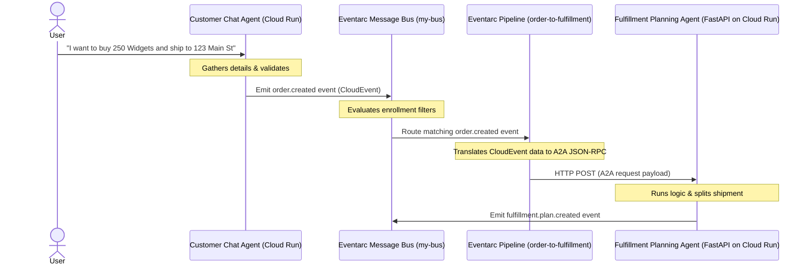

# Asynchronous Event-Driven AI Agents with Google Cloud Eventarc, Cloud Run, and ADK

This repository demonstrates how to build an asynchronous, completely decoupled micro-agent architecture on Google Cloud. Instead of building a monolithic "super-agent" with context bloat, this design uses specialized, autonomous AI agents that communicate strictly by emitting and reacting to events via **Cloud Eventarc Advanced**.

This pattern showcases the **Agent2Agent (A2A)** protocol, which routes structured prompts to specialized agents as standard CloudEvents. It highlights how Google Cloud's Eventarc pipelines can transform generic events into strict JSON-RPC structures on the fly.

---

## Architecture & Data Flow

The system models a wholesale store fulfillment workflow consisting of two distinct micro-agents:

1. **Customer Chat Agent (`/customer-chat`)**: A user-facing web interface built using the Google Agent Development Kit (ADK). It interacts with the customer to validate order parameters (items, quantity, shipping address). Once all details are collected, it calls the `emit_business_event` tool to publish an `order.created` event.
2. **Fulfillment Planning Agent (`/fulfillment-planning`)**: A headless backend service wrapped in the A2A protocol using FastAPI. It subscribes to `order.created` events, calculates fulfillment costs, splits high-volume shipments (>200 items) into internal and third-party deliveries, and publishes a `fulfillment.plan.created` event.

### System Diagram



---

## Directory Structure

```text
eventarc-ai-agents/
├── customer-chat/
│   ├── agent.py          # Chat agent definition, prompts, and event publishing tool
│   ├── Dockerfile        # Container setup running 'adk web' UI
│   └── requirements.txt  # Dependencies (google-adk[a2a], google-cloud-eventarc-publishing, etc.)
├── fulfillment-planning/
│   ├── agent.py          # Backend planning agent, A2A FastAPI endpoint wrapper
│   ├── Dockerfile        # Container setup running Uvicorn web server
│   └── requirements.txt  # Dependencies
├── terraform/            # Infrastructure-as-Code to provision GCP resources
│   ├── main.tf
│   ├── variables.tf
│   └── outputs.tf
└── README.md             # Project documentation
```

---

## Local Development & Testing

You can run and test this micro-agent workflow locally before deploying to Google Cloud.

### 1. Run the Fulfillment Agent Locally
First, navigate to the `fulfillment-planning` directory, install requirements, and run the service:

```bash
cd fulfillment-planning
python -m venv venv
source venv/bin/activate
pip install -r requirements.txt uvicorn

# Set a mock eventarc bus name for local run
export EVENTARC_BUS_NAME="projects/mock-project/locations/us-central1/messageBuses/mock-bus"
uvicorn agent:a2a_app --host 0.0.0.0 --port 8000
```

### 2. Test the Fulfillment Agent with a Mock Event
Open another terminal window and send a simulated Eventarc-bound A2A request using `curl`. This payload represents the exact structure that Eventarc creates using its CEL binding template:

```bash
curl -X POST http://localhost:8000/ \
  -H "Content-Type: application/json" \
  -H "A2A-Version: 1.0" \
  -d '{
    "jsonrpc": "2.0",
    "id": "12345",
    "method": "message/send",
    "params": {
      "message": {
        "role": "user",
        "messageId": "12345",
        "parts": [
          {
            "text": "\nCreate a fulfillment plan for the following order:\n------------------\nOrder ID: ORD-999\nAddress: 1600 Amphitheatre Pkwy, Mountain View, CA\nItems: [{\"item_name\": \"Super Widgets\", \"quantity\": 250}]\nNotes: Deliver to back dock\n"
          }
        ]
      },
      "configuration": {
        "blocking": true
      }
    }
  }'
```

If successful, you will see the planning agent's logs showing tool execution, processing the split shipment plan, and executing `emit_business_event` (which will fail to publish if Google credentials are missing, but demonstrates the internal agent logic).

---

## Deploying to Google Cloud

### Prerequisites
* A Google Cloud Project with billing enabled.
* Vertex AI, Cloud Run, Eventarc, Artifact Registry, and Cloud Build APIs enabled:
  ```bash
  gcloud services enable \
      eventarc.googleapis.com \
      eventarcpublishing.googleapis.com \
      run.googleapis.com \
      aiplatform.googleapis.com \
      cloudbuild.googleapis.com \
      artifactregistry.googleapis.com
  ```

---

### Option A: Manual Deployment via `gcloud`

#### 1. Deploy the Containers to Cloud Run
Deploy the **Customer Chat Agent**:
```bash
gcloud run deploy customer-chat \
    --source ./customer-chat \
    --region us-central1 \
    --allow-unauthenticated \
    --clear-base-image \
    --set-env-vars EVENTARC_BUS_NAME=projects/$(gcloud config get-value project)/locations/us-central1/messageBuses/my-bus
```

Deploy the **Fulfillment Planning Agent**:
```bash
gcloud run deploy fulfillment-planning \
    --source ./fulfillment-planning \
    --region us-central1 \
    --allow-unauthenticated \
    --clear-base-image \
    --set-env-vars EVENTARC_BUS_NAME=projects/$(gcloud config get-value project)/locations/us-central1/messageBuses/my-bus
```

#### 2. Create the Message Bus
```bash
gcloud eventarc message-buses create my-bus \
    --location=us-central1 \
    --logging-config=DEBUG
```

#### 3. Create the Eventarc Pipeline
The pipeline securely bridges the Eventarc Bus to the backend `fulfillment-planning` Cloud Run instance. It intercepts the CloudEvent payload and uses **Common Expression Language (CEL)** templates to transform it into the JSON-RPC format expected by the A2A endpoint:

```bash
# Capture the deployed URL of your backend agent
FULFILLMENT_URL=$(gcloud run services describe fulfillment-planning --region us-central1 --format 'value(status.url)')

# Create the pipeline with data-binding translation
gcloud eventarc pipelines create order-to-fulfillment \
    --location=us-central1 \
    --input-payload-format-json= \
    --destinations=http_endpoint_uri="${FULFILLMENT_URL}",http_endpoint_message_binding_template='{
      "headers": headers.merge({
        "Content-Type": "application/json",
        "A2A-Version": "1.0",
        "x-envoy-upstream-rq-timeout-ms": "600000"
      }),
      "body": {
        "jsonrpc": "2.0",
        "id": message.id,
        "method": "message/send",
        "params": {
          "message": {
            "role": "user",
            "messageId": message.id,
            "parts": [
              {
                "text": "\nCreate a fulfillment plan for the following order:\n------------------\nOrder ID: " + message.data.order_id + "\nAddress: " + message.data.shipping_address + "\nItems: " + message.data.items.toJsonString() + "\nNotes: " + message.data.user_note + "\n"
              }
            ]
          },
          "configuration": {
            "blocking": true
          }
        }
      }
    }' \
    --logging-config=DEBUG
```

#### 4. Create the Enrollment Filter
The active trigger rule that listens to the bus and passes any traffic matching `order.created` to the pipeline:
```bash
gcloud eventarc enrollments create match-orders \
    --location=us-central1 \
    --cel-match="message.type == 'order.created'" \
    --destination-pipeline=order-to-fulfillment \
    --message-bus=my-bus
```

---

### Option B: Infrastructure-as-Code via Terraform

We provide a complete Terraform module in the `terraform/` directory to deploy the Eventarc Advanced message routing glue cleanly.

1. Navigate to the `terraform/` directory.
2. Initialize and apply:
   ```bash
   cd terraform
   terraform init
   terraform apply -var="project_id=YOUR_PROJECT_ID" -var="fulfillment_agent_url=YOUR_CLOUD_RUN_URL"
   ```

---

## Under the Hood: Key Eventarc Features

* **`blocking: true`**: Tells the Eventarc pipeline to keep the connection open until the AI model finishes generating the plan. Because Cloud Run instances only receive full CPU allocation while actively processing an HTTP request, blocking prevents the container from being throttled or scaled down mid-thought.
* **`x-envoy-upstream-rq-timeout-ms`**: Extends the default downstream system connection timeout to 10 minutes ($600,000\text{ ms}$). This is crucial since LLM response generation takes significantly longer than standard REST microservices.
* **CEL Data Binding Template**: The `message_binding_template` dynamically maps values from the input Eventarc CloudEvent (e.g. `message.id` and fields inside `message.data`) directly into a JSON structure, bypassing the need for a separate "translator" microservice.
